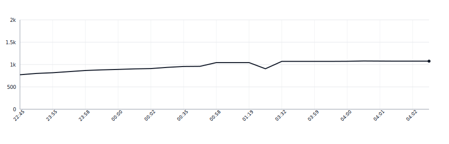

[](https://github.com/apakabarlabs/serbian-translit-python/actions/workflows/tests.yml)

# serbian-translit

Deterministic Serbian and Montenegrin script conversion — Cyrillic ↔ Latin — with case preservation, digraph handling, quoted-region protection, and Roman-numeral / non-native-word filtering.

Both official scripts of Serbian (and Montenegrin) map one-to-one at the letter level: `љ↔lj`, `њ↔nj`, `џ↔dž`, plus `с́↔ś`, `з́↔ź` for Montenegrin. The library plays the pairing from a YAML table; there is no per-language code path in the engine.

## Installation

The library is distributed as a git tag (not published to PyPI). Install from GitHub:

```bash
pip install git+https://github.com/apakabarlabs/serbian-translit-python.git@v0.2.0
```

## Usage

```python
from serbian_translit import srp, cnr

srp.to_cyr("Njujork")           # 'Њујорк'
srp.to_cyr("LJUBAV")            # 'ЉУБАВ'
srp.to_cyr("New York")          # 'New York' (word skipped — has non-native letters)
srp.to_cyr('grupa „AC/DC"')     # 'група „AC/DC"' (quoted region preserved)
srp.to_lat("Њујорк")            # 'Njujork'

cnr.to_cyr("śever")             # 'с́евер' (с + U+0301)
cnr.to_lat("с́евер")             # 'śever'
```

## Behaviour

- **Digraphs** `lj`, `nj`, `dž` (Latin) ↔ `љ`, `њ`, `џ` (Cyrillic) with case preservation (`Nj` in title-case position, `NJ` inside all-caps).
- **Montenegrin extras** `ś`, `ź` ↔ `с́`, `з́` (base letter + combining acute U+0301; no precomposed codepoints exist).
- **Đ variants** `Đ` (U+0110), `đ` (U+0111), `Ð` (U+00D0 Eth), `ð` (U+00F0 eth) all map to `Ђ`/`ђ`.
- **Roman numerals** (`II`, `XIV`, `XX`) stay in Latin regardless of direction.
- **Words with non-native letters** (Latin `w`, `x`, `y`, `q`) are skipped whole — treated as foreign inclusions.
- **Quoted regions** (`"…"`, `„…"`, `“…”`, `«…»`) are preserved verbatim so brand names and foreign quotes survive round-trip.
- **Non-alphabetic content** (numbers, punctuation, whitespace) is left unchanged.

## Rules and tests

Rules live in [`serbian_translit/data/rules.yaml`](serbian_translit/data/rules.yaml); test cases in [`serbian_translit/data/tests.yaml`](serbian_translit/data/tests.yaml). Both files are the source of truth shared with the [Swift](https://github.com/apakabarlabs/serbian-translit-swift) and (upcoming) Kotlin ports so behaviour stays identical across languages.

## Lines of Code

<picture>
  <source media="(prefers-color-scheme: dark)" srcset=".github/loc-history-dark.svg">
  <source media="(prefers-color-scheme: light)" srcset=".github/loc-history-light.svg">
  
</picture>
